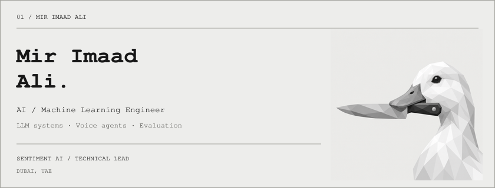
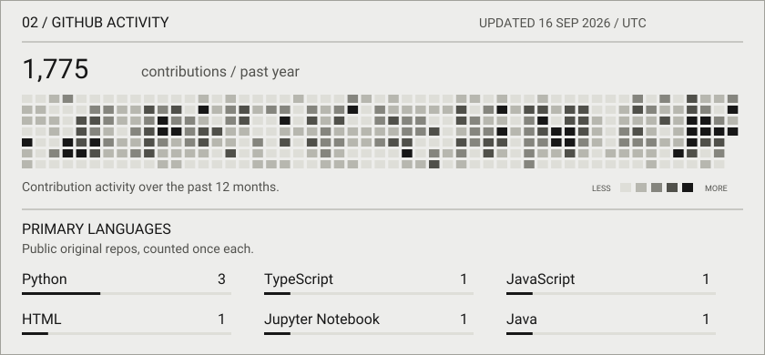

<picture>
  <source media="(prefers-color-scheme: dark)" srcset="assets/header-dark.png">
  
</picture>

[Portfolio ↗](https://portfolio-beta-nine-19h42szfbx.vercel.app) · [Resume ↓](https://portfolio-beta-nine-19h42szfbx.vercel.app/Mir_Imaad_Ali_Resume.pdf) · [LinkedIn ↗](https://www.linkedin.com/in/mir-imaad-ali-bb2390220/) · [Email ↗](mailto:mirimaadali1@gmail.com)

I build enterprise AI at **Sentiment AI**, where I own the technical stack for a behavioral analytics product in production. My work covers long-context LLM pipelines, voice agents, evaluation, and inference infrastructure.

| Currently building | Tools in use |
| :--- | :--- |
| Voice agents and evaluation workflows | PydanticAI · DSPy · RAGAS · Langfuse |
| Long-context inference and model routing | H100 GPUs · LiteLLM · PyTorch |
| Enterprise integrations and orchestration | Python · Temporal · Postgres |

<picture>
  <source media="(prefers-color-scheme: dark)" srcset="assets/activity-dark.svg">
  
</picture>

### 03 / Selected work

| Project | What I built |
| :--- | :--- |
| [Continuous ASL recognition](https://github.com/MirImaadAli1/ASL-Recognition-DeepLearning) | ResNet18 and BiLSTM for sign recognition from How2Sign video. |
| [PaperBot](https://portfolio-beta-nine-19h42szfbx.vercel.app/projects) | Research-paper QA with LangChain, FAISS, GPT, and Django. Pipeline optimization cut query response time by 50%. |
| [E-ink portfolio](https://portfolio-beta-nine-19h42szfbx.vercel.app) | A Three.js cube interface with monochrome dithering and keyboard navigation. |

### 04 / Research & background

**To BI or not To BI?** · CAIT 2024 · December 2024 
Compared transformer and deep learning models for suicidal ideation detection. BERT reached 98.6% accuracy in the study.

**PromptRefine** · EAI ArtsIT · November 2025 
Refining vague, ambiguous, or biased prompts. Evaluated across OpenAI and Anthropic models.

[Read about the research ↗](https://portfolio-beta-nine-19h42szfbx.vercel.app/research)

BSc Computer Science, **First Class Honours · 4.0 GPA** 
Heriot-Watt University · 2025 · UAE Golden Visa holder

---

Public GitHub data refreshes daily. Most of my current enterprise work lives outside these repositories.
